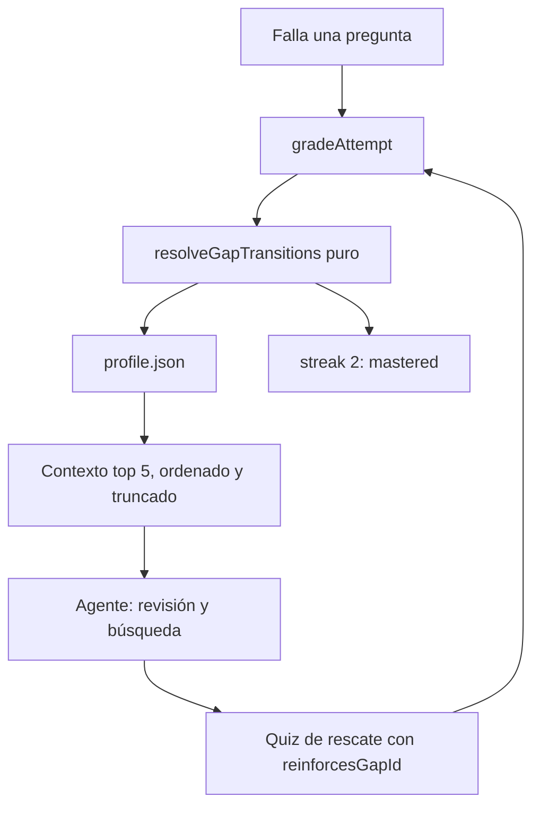

# Proxus: un ciclo verificable de estudio

Proxo es un tutor académico local que trabaja con materiales PDF, artefactos de estudio y un perfil de lagunas. La tesis de esta entrega es concreta: **el tutor no solo recuerda los fallos; cierra el bucle con evidencia de dominio derivada de intentos corregidos**.

El agente declara intención (`knowledge review`). No declara veredictos (`knowledge master`). El veredicto lo emite el corrector, a partir de preguntas de refuerzo ancladas a una laguna real.

## Problema

El flujo anterior detectaba preguntas falladas, pero dejaba abierta la segunda mitad del ciclo. El chat podía recordar una laguna y el agente podía intentar marcarla como dominada, pero no había una relación estructural entre la pregunta de rescate y el fallo original. Tampoco había contador de fallos ni una prueba visible de qué quiz produjo el avance.

El resultado era un tutor con memoria parcial y un estado de dominio dependiente del comportamiento del LLM.

## Diseño



Cada pregunta de quiz o test puede llevar `reinforcesGapId`. Las preguntas ligadas al mismo gap se agregan antes de transicionar, así que el veredicto no depende del orden de las correcciones. Al corregir:

- un fallo sin ancla crea una laguna o incrementa la existente;
- un acierto posterior en la misma pregunta original (mismo artifact y `questionId`) incrementa `correctStreak`;
- un fallo con ancla actualiza la laguna original (un intento cuenta como una sola regresión);
- un acierto anclado incrementa `correctStreak` (varios aciertos en el mismo intento se suman);
- si el mismo intento mezcla acierto y fallo anclados, gana el fallo y la racha se reinicia;
- el segundo acierto anclado pasa la laguna a `mastered` con `masteryEvidence: "graded-attempt"`;
- un fallo posterior vuelve a abrirla, reinicia la racha y borra la evidencia de dominio;
- un ancla inexistente se registra en `knowledgeUpdates.orphanedAnchorIds`; si la pregunta se falló, se crea una laguna nueva.

El umbral exportado es `MASTERY_STREAK = 2`. Un solo acierto no cierra una laguna.

## Decisiones

`resolveGapTransitions` no llama al modelo ni al repositorio. Devuelve upserts y un resumen con `masteredGapIds`, `reinforcedGapIds`, `newGapIds` y `orphanedAnchorIds`. `FileKnowledgeRepository.applyTransitions` persiste esos estados sin forzar `active`.

Los campos de progreso de `KnowledgeGap` son opcionales. Así, un `profile.json` anterior sigue decodificando sin caer al perfil vacío. El wrapper de grading añade `knowledgeUpdates` al intento corregido para que el ciclo sea visible en el resultado del quiz y en el acta del simulacro.

El contexto del tutor se construye en `buildKnowledgeGapContext`: ordena por `failCount` descendente, después por `failedAt`, incluye cinco lagunas por defecto, recorta la pregunta a unos 120 caracteres y deja una salida explícita hacia `knowledge gaps`.

El comando `knowledge master` permanece como guardarraíl, pero rechaza la escritura con una explicación. El panel web sí puede marcar una laguna manualmente; ese estado queda identificado como `masteryEvidence: "manual"`.

## Límites conocidos

- La inyección de lagunas no está condicionada al tipo de turno. Si hay lagunas activas, el bloque entra en el system prompt y se reenvía en cada paso del bucle de herramientas. El tope de cinco recorta el tamaño, no el número de veces que se paga. Con más tiempo la limitaría a turnos de estudio o repaso, y no la reenviaría en cada step del tool loop.
- `profile.json` no tiene escrituras transaccionales: dos procesos concurrentes pueden pisarse. Es aceptable para el modo local monousuario; los nuevos campos opcionales evitan perder perfiles antiguos.
- El qué preguntar sigue siendo criterio del LLM. El sistema hace determinista el veredicto, no la calidad pedagógica de la pregunta.
- No hay SRS/FSRS. `correctStreak` es un proxy de dominio y no modela la curva de olvido.
- `reinforcesGapId` es una relación 1:1: una pregunta solo puede reforzar una laguna.
- Los contratos de artefactos están duplicados entre `packages/shared` y el dominio del servidor; se mantienen sincronizados de forma explícita.
- La persistencia sigue siendo local y no separa usuarios.

## Cómo probarlo

Requisitos: Node.js, pnpm, Poppler (`pdfinfo`, `pdftoppm`, `pdftotext`) y `GOOGLE_GENERATIVE_AI_API_KEY`.

```sh
pnpm install
cp .env.example .env
pnpm run dev
```

Checks automatizables:

```sh
pnpm run typecheck
pnpm test                      # 130 tests, server + web
pnpm --filter @proxus/web run build
pnpm --filter @proxus/server run eval:tutor:knowledge-gap
```

Los tests de la máquina de estados, del contexto y de retrocompatibilidad no requieren LLM. Están en `packages/server/src/domain/knowledge/gap-progress.test.ts` (incluye la mezcla acierto/fallo en el mismo intento), `gap-context.test.ts` y `file-knowledge-repository.test.ts`. La eval sí requiere la clave de Gemini.

## Demostración manual

1. Crea un quiz, falla dos preguntas y abre la pestaña de Lagunas. Deben aparecer con `Fallada 1 vez`.
2. Repite el quiz con los mismos fallos. El contador sube a 2 y no aparece un duplicado.
3. Pide un rescate. El artefacto guardado debe contener `reinforcesGapId` con un id del perfil.
4. Acierta una pregunta de rescate: la laguna pasa a `reviewing` con progreso 1/2.
5. Acierta otra pregunta ligada: pasa a `mastered` y muestra `Verificada por quiz`.
6. Falla después una pregunta ligada: la laguna vuelve a `active`.
7. Intenta usar `knowledge master`: el comando debe rechazar la operación.

## Evaluación

`eval:tutor:knowledge-gap` ejecuta el mismo prompt con y sin contexto de lagunas. La señal esperada debe aparecer en el primer run y no en el control. La misma eval comprueba que un quiz de rescate use anclas válidas y que `knowledge master` sea rechazado.

La evaluación no demuestra que todas las preguntas de rescate sean buenas. Demuestra una separación concreta: el agente puede seleccionar y redactar; el corrector decide el estado.

El repo incluye tres evals adicionales (`eval:tutor:socratic`, `eval:tutor:search`, `eval:tutor:artifact-authoring`) que cubren otras capacidades del agente; no son el foco de esta entrega pero están disponibles con la misma API key.

## Stack

- Monorepo pnpm con `packages/shared`, `packages/server`, `packages/web` y `packages/ai-google`.
- Node.js, TypeScript y Effect HTTP API en el servidor.
- React, Vite y Tailwind en el cliente.
- Gemini para el tutor; Poppler para leer y renderizar PDFs.
- Ficheros JSON locales bajo `packages/server/.data`.

## Otras mejoras

- Search-then-view: localizar texto antes de renderizar páginas PDF.
- Quiz frente a simulacro: práctica con feedback y examen con cronómetro y acta.
- Mind maps: esquema navegable persistido por material.
- Voz: dictado desde el navegador para las consultas del tutor.
- Menciones `@`: referenciar materiales concretos desde el chat.
- Onboarding: adaptar nivel, dificultad y estilo de explicación.
