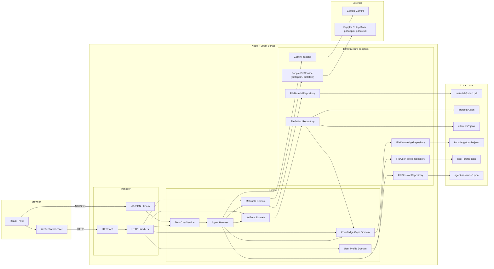
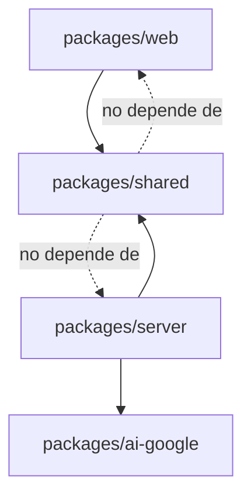
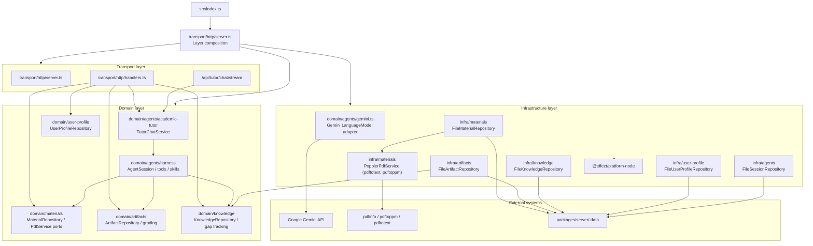

# Arquitectura

## Vista general

El repo está organizado como monorepo `pnpm`:

- `packages/shared`: contratos de API y schemas compartidos (Materials, Artifacts, Knowledge, UserProfile, Tutor).
- `packages/server`: dominio, infraestructura y transporte HTTP.
- `packages/web`: UI React, componentes de estudio y estado reactivo.
- `packages/ai-google`: integración local de Google AI para Effect.

## Dirección de dependencias

`shared` no depende de `server` ni de `web`. Es la capa que evita que el contrato HTTP se duplique manualmente en ambos lados.

## Shared: contratos y schemas

Archivos principales:

- `packages/shared/src/api/Api.ts`: Definición agregada de `ProxusApi`.
- `packages/shared/src/api/tutor.ts`: Contrato de chat con modos pedagógicos (`socratic`, `explanatory`).
- `packages/shared/src/api/materials.ts`: Ingesta, renderizado de páginas, eliminación y metadatos.
- `packages/shared/src/api/artifacts.ts`: Creación, listado y envío de intentos (`submit`).
- `packages/shared/src/api/knowledge.ts`: Consulta y actualización de lagunas de conocimiento (`KnowledgeGap`).
- `packages/shared/src/api/user-profile.ts`: Consulta y guardado de perfil de estudio y preferencias.
- `packages/shared/src/schemas/*`: Definición estricta de esquemas Effect `Schema`.

## Server: transporte, dominio e infraestructura

El backend separa limpiamente tres responsabilidades:

- **Transporte**: HTTP, streaming NDJSON, OpenAPI y adaptación request/response.
- **Dominio**: reglas de negocio, contratos internos, tutor, lagunas, perfil de usuario, artefactos y materiales.
- **Infraestructura**: implementaciones concretas contra filesystem (`.data/`), Poppler (`pdftoppm`, `pdftotext`), Node y Gemini.

### Transporte

Archivos principales:

- `packages/server/src/index.ts`: arranca el runtime Node y lanza el server.
- `packages/server/src/transport/http/server.ts`: compone rutas, docs, stream NDJSON y layers.
- `packages/server/src/transport/http/handlers.ts`: implementa los endpoints definidos en `packages/shared`.

### Dominio

Archivos principales:

- `packages/server/src/domain/agents/*`: orquestación de tutor, skills y comandos.
- `packages/server/src/domain/agents/harness/*`: motor de ejecución de tools y sesiones.
- `packages/server/src/domain/artifacts/*`: ciclo de vida de artefactos (`note`, `quiz`, `test`) y motor de corrección (`gradeAttempt`).
- `packages/server/src/domain/knowledge/*`: modelo de lagunas de conocimiento (`KnowledgeGap`) y seguimiento de debilidades.
- `packages/server/src/domain/user-profile/*`: perfil de aprendizaje del alumno.
- `packages/server/src/domain/materials/*`: gestión de PDFs y búsqueda léxica.

### Infraestructura

Archivos principales:

- `packages/server/src/infra/agents/file-session-repository.ts`: sesiones en `.data/agent-sessions`.
- `packages/server/src/infra/artifacts/file-artifact-repository.ts`: almacenamiento de notas, quizzes, tests e intentos. Extrae automáticamente lagunas de conocimiento hacia `KnowledgeRepository`.
- `packages/server/src/infra/knowledge/file-knowledge-repository.ts`: persistencia de lagunas y progreso en `.data/knowledge/profile.json`.
- `packages/server/src/infra/user-profile/file-user-profile-repository.ts`: configuración del alumno en `.data/user_profile.json`.
- `packages/server/src/infra/materials/file-material-repository.ts`: documentos PDF en `.data/materials/pdfs/` y búsqueda textual con `pdftotext`.
- `packages/server/src/infra/materials/poppler-pdf-service.ts`: servicio Poppler para extracción de coordenadas vectoriales de texto y renderizado de imágenes a 144 DPI.
- `packages/server/src/domain/agents/gemini.ts`: adaptador REST resiliente contra la API de Gemini.

## Tutor agent

El tutor está implementado como un harness de agente con herramientas públicas:

- `load_skill`: carga instrucciones especializadas (`use-uploaded-materials`, `search-materials`, `create-study-artifacts`, `review-knowledge-gaps`).
- `cli`: ejecuta comandos permitidos (`materials list/search/view/delete`, `artifacts list/show/create/submit/attempts/grade`, `knowledge gaps/summary/review/master`).

## Web: estado y UI

Entrada:

- `packages/web/src/App.tsx`

Componentes principales:

- `packages/web/src/components/Sidebar.tsx`: navegación de biblioteca de PDFs, apuntes, quizzes y exámenes.
- `packages/web/src/components/Chat.tsx`: interfaz del tutor con dictado de voz, menciones `@`, selector de modos e historial.
- `packages/web/src/components/ArtifactWorkspace.tsx`: visor de notas y simulador interactivo de quizzes/tests con temporizador.
- `packages/web/src/components/KnowledgeGapsPanel.tsx`: panel de control de lagunas de aprendizaje y tasa de dominio.
- `packages/web/src/components/MindMapViewer.tsx`: esquemas y mapas mentales 100% dinámicos con zoom y pan espacial.
- `packages/web/src/components/PdfSplitViewer.tsx`: visor de PDF con subrayado vectorial y menú contextual flotante para consultar a la IA.
- `packages/web/src/components/ConversationalOnboarding.tsx`: onboarding guiado para personalización pedagógica.
- `packages/web/src/components/UserProfileModal.tsx`: gestión de memoria y perfil del estudiante.

Estado remoto reactivo con Effect Atom:

- `packages/web/src/domain/materials/atoms.ts`
- `packages/web/src/domain/artifacts/atoms.ts`
- `packages/web/src/domain/knowledge/atoms.ts`
- `packages/web/src/domain/user-profile/atoms.ts`
- `packages/web/src/domain/sessions/storage.ts`
